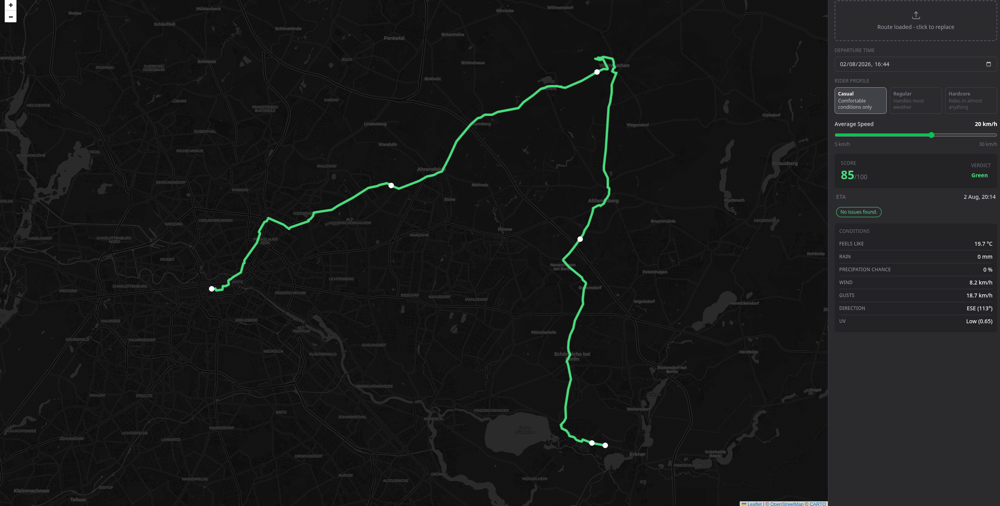

# Velocast

**Demo:** [funcnroll.github.io/velocast/](https://funcnroll.github.io/velocast/)

Upload a GPX route, set your departure time, speed, along with your rider profile and get a scored weather forecast for each segment along your route as you'll actually encounter it.

Built because existing tools either sit behind a paywall or surface raw data without telling you whether conditions are actually worth riding in.

## Why I Built This

Standard weather apps show conditions for one location at one time. For a long ride that crosses different terrain over several hours, that's not useful. Velocast answers another, more relevant question: what will the weather actually be like when I'm at that specific point on the route?

## How It Works

- **Time-aware waypoint forecasting**: Turf.js samples waypoints at fixed 15km intervals using its `along` function, walking the route geometry at exact distances rather than snapping to the nearest raw GPS point. 15km was chosen deliberately: Open-Meteo's data doesn't meaningfully differ at shorter intervals, and it keeps request count manageable on long routes. Each waypoint's ETA is matched to the correct hourly slot in Open-Meteo's response, accounting for the location's timezone so the lookup is always accurate.

- **Exponential penalty scoring**: Each segment starts at a score of 100. Weather factors (wind, gusts, apparent temperature, rain, precipitation probability) each subtract a penalty calculated as `(value / max) ^ exponent * maxPenalty * profileMultiplier`. The exponent curves the penalty so low values barely register but high values are punished disproportionately, which avoids jarring score jumps from hard thresholds. Dangerous weather codes are a hard override that bypass the formula entirely and return red immediately.

- **Rider profile sensitivity**: Wind, rain as well as temperature penalties each accept a multiplier from the active rider profile. A casual rider gets multipliers above 1, so the same conditions hit harder; a hardcore rider gets multipliers below 1, softening the same inputs. The scoring formula itself never changes, only the weight applied per factor per profile.

## Handled Issues

- **Coordinate system handling**: Turf.js, GeoJSON, Leaflet and Open-Meteo each handle coordinates differently (GeoJSON/Turf use `[lng, lat]`, Leaflet expects `[lat, lng]`, Open-Meteo takes separate query params). Coordinates are stored internally in GeoJSON order and flipped only at the boundary where they're handed off to Leaflet or the weather API. Mixing these up silently produces wrong map positions and incorrect forecasts with no obvious error.

- **API rate limiting**: Longer routes generate many waypoint requests to Open-Meteo in quick succession. Bottleneck throttles outgoing calls to stay under the API's rate limits instead of firing all requests at once and risking dropped or delayed responses.

## Stack

React, TypeScript, Vite, Leaflet, Tailwind CSS, Turf.js, Open-Meteo API, Bottleneck, date-fns, react-hot-toast, useHooks

## Notes

Core logic (GPX processing, rate limiting, weather scoring) written by hand. UI and minor refactors assisted by Claude (Anthropic).

This write-up expands on a detailed description originally presented elsewhere, now moved here.
